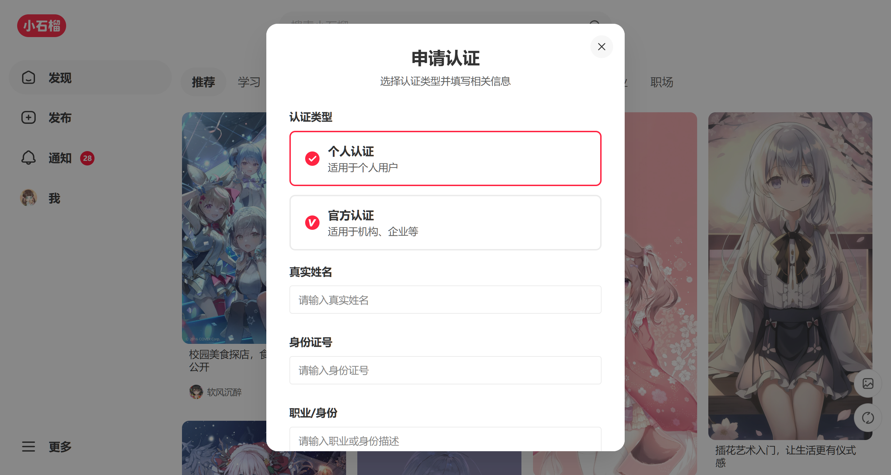
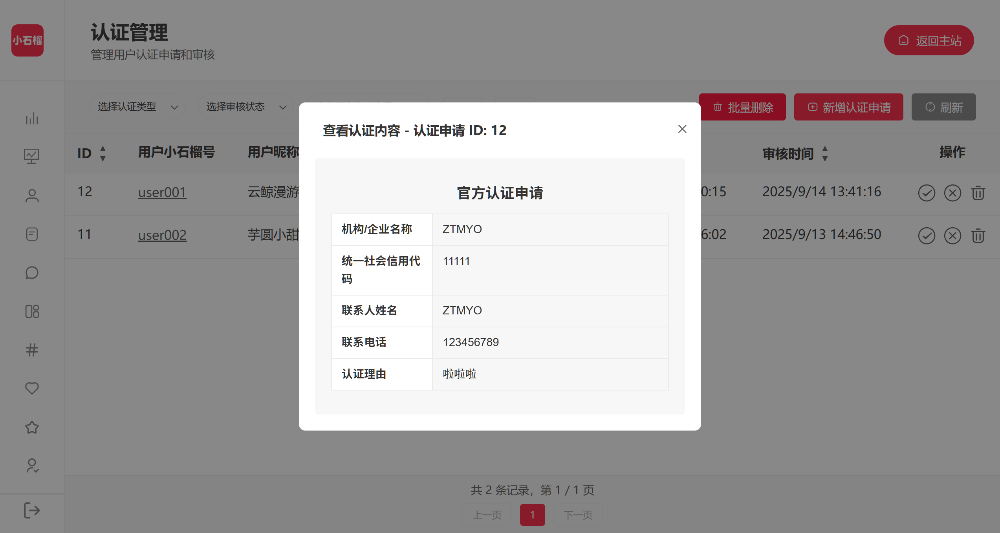
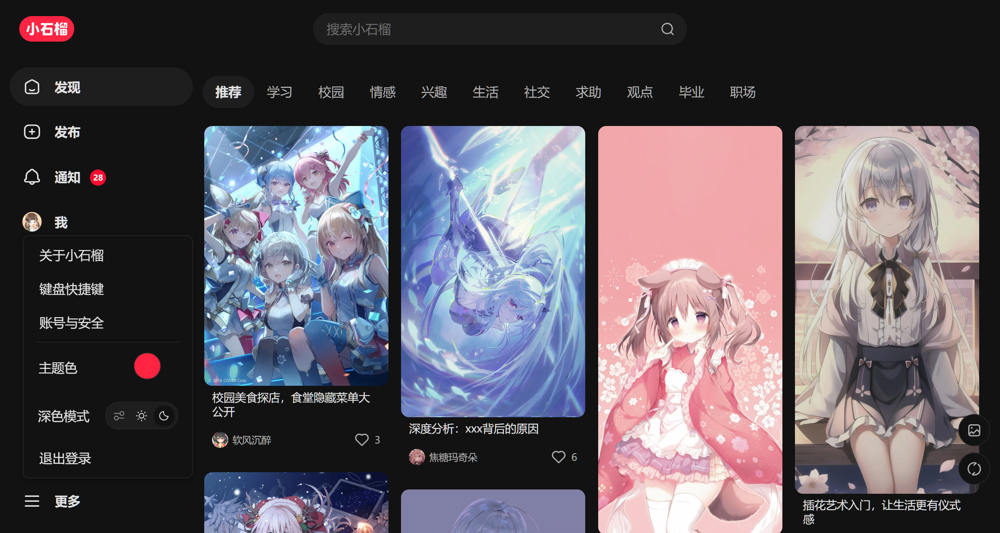

<p align="center">
    
</p>
<h1 align="center" style="margin: 20px 30px 0px 30px; font-weight: bold;">XiaoShiLiu</h1>

---
<p align="center">
    <b>基于 Express + Vue 前后端分离仿小红书项目</b>
</p>
<p align="center">
    <i>一个高仿小红书的图文社区项目，支持图文发布、社交互动等核心功能，旨在提供从前端到后端的完整实践范本</i>
<p align="center"><a href="https://www.shiliu.space">演示网站</a> · <a href="https://www.bilibili.com/video/BV1J4agztEBX/?spm_id_from=333.1387.homepage.video_card.click">视频介绍</a>
</p>
<p align="center"><a href="https://github.com/ZTMYO/XiaoShiLiu">简体中文</a>|<a href="doc/i18n/README_En.md">English</a>|<a href="doc/i18n/README_zh-Hant.md">繁體中文</a>

<p align="center">
    <a href="https://github.com/ZTMYO/XiaoShiLiu/stargazers">
        
    </a>
    <a href="https://github.com/ZTMYO/XiaoShiLiu/network/members">
        
    </a>
    <a href="https://github.com/ZTMYO/XiaoShiLiu">
        
    </a>
    <a href="https://github.com/ZTMYO/XiaoShiLiu/blob/master/LICENSE">
        
    </a>
</p>
<p align="center">
    
    
    </a>
</p>


> **声明**  
> 本项目基于 [GPLv3 协议](./LICENSE)，免费开源，仅供学习交流，禁止转卖，谨防受骗。如需商用请保留版权信息，确保合法合规使用，运营风险自负，与作者无关。

---

> 📁 **项目结构说明**：本项目包含完整的前后端代码，前端位于 `vue3-project/` 目录，后端位于 `express-project/` 目录。详细结构请查看 [项目结构文档](./doc/PROJECT_STRUCTURE.md)。

## 项目展示

### PC端界面

<table>
  <tr>
    <td></td>
    <td></td>
    <td></td>
  </tr>
  <tr>
    <td></td>
    <td></td>
    <td></td>
  </tr>
  <tr>
    <td></td>
    <td></td>
    <td></td>
  </tr>
  <tr>
    <td></td>
    <td></td>
    <td></td>
  </tr>
  <tr>
    <td></td>
    <td></td>
    <td></td>
  </tr>
    <tr>
    <td></td>
    <td></td>
    <td></td>
  </tr>
</table>


### 移动端界面

<table>
  <tr>
    <td></td>
    <td></td>
    <td></td>
    <td></td>
  </tr>
  <tr>
    <td></td>
    <td></td>
    <td></td>
    <td></td>
  </tr>
  <tr>
    <td></td>
    <td></td>
    <td></td>
    <td></td>
  </tr>
</table>

## 项目文档

| 文档 | 说明 |
|------|------|
| [部署指南](./doc/DEPLOYMENT.md) | 部署配置和环境搭建说明 |
| [项目结构](./doc/PROJECT_STRUCTURE.md) | 项目目录结构架构说明 |
| [数据库设计](./doc/DATABASE_DESIGN.md) | 数据库表结构设计文档 |
| [API接口文档](./doc/API_DOCS.md) | 后端API接口说明和示例 |

## 项目亮点

- **工程化：** 环境配置、代码规范、构建与产物优化的完整流程
- **业务能力：** 鉴权流程、路由守卫、状态管理与接口封装
- **体验优化：** 骨架屏、懒加载、预加载、无障碍与响应式适配
- **组件与分层：** 可复用组件拆分、按领域分组与别名引入
- **后台管理：** 基础CRUD、数据管理与配置面板，支持后续扩展权限与统计
- **快速部署：** 基于 Docker 的一键部署方案，支持多环境配置与自动化部署

## 技术栈

> 💡点击可展开查看详细内容
<details>
<summary><b>前端技术</b></summary>

- **Vue.js 3** - 前端框架（Composition API）
- **Vue Router 4** - 路由管理
- **Pinia** - 状态管理
- **Vite** - 构建工具和开发服务器
- **Axios** - HTTP客户端
- **VueUse** - Vue组合式工具库
- **CropperJS** - 图片裁剪
- **Vue3 Emoji Picker** - 表情选择器
- **svg-captcha** - 验证码生成器
</details>

<details>
<summary><b>后端技术</b></summary>

- **Node.js** - 运行环境
- **Express.js** - Web框架
- **MySQL** - 数据库
- **JWT** - 身份认证
- **Multer** - 文件上传
- **bcrypt** - 密码加密
- **CORS** - 跨域资源共享

</details>


## 第三方API
- **图片存储：** 灌装的示例图片来自 [栗次元图床](https://t.alcy.cc/)，提供稳定的图片存储服务
- **图片上传：** 用户上传图片使用了 [夏柔API](https://api.aa1.cn/doc/xinyew_jdtc.html)，确保图片上传的稳定性和速度
- **属地查询：** IP属地查询服务使用 [保罗API](https://api.pearktrue.cn/dashboard/detail/290)，实现精准的IP属地定位功能


## 环境要求

| 组件 | 版本要求 |
|------|----------|
| Node.js | >= 16.0.0 |
| MySQL | >= 5.7 |
| MariaDB | >= 10.3 |
| npm | >= 8.0.0 |
| yarn | >= 1.22.0 |
| 浏览器 | 支持ES6+ |

> 提示：上述为传统本地开发的最低版本要求。若使用 Docker 部署，默认镜像版本如下：MySQL 5.7、Node 18-alpine（前后端构建/运行）、Nginx alpine；Docker >= 20、Docker Compose >= 2。详见[部署指南文档](./doc/DEPLOYMENT.md)。

## 环境配置

项目使用环境变量进行配置管理，前后端分别有独立的 `.env` 文件：

### 后端配置 (express-project/.env)

```env
# 服务器配置
PORT=3001
NODE_ENV=development

# 数据库配置
DB_HOST=localhost
DB_USER=root
DB_PASSWORD=123456
DB_NAME=xiaoshiliu
DB_PORT=3306

# JWT配置
JWT_SECRET=xiaoshiliu_secret_key_2025
JWT_EXPIRES_IN=7d
REFRESH_TOKEN_EXPIRES_IN=30d

# API配置
API_BASE_URL=http://localhost:3001

# 上传配置
UPLOAD_MAX_SIZE=50mb
# 图片上传策略 (local: 本地存储, imagehost: 第三方图床, r2: Cloudflare R2)
IMAGE_UPLOAD_STRATEGY=imagehost
# 视频上传策略 (local: 本地存储, r2: Cloudflare R2)
VIDEO_UPLOAD_STRATEGY=local

# 本地存储配置
LOCAL_UPLOAD_DIR=uploads
LOCAL_BASE_URL=http://localhost:3001
# 视频存储目录
VIDEO_UPLOAD_DIR=uploads/videos
# 视频封面存储目录
VIDEO_COVER_DIR=uploads/covers

# 第三方图床配置（当IMAGE_UPLOAD_STRATEGY=imagehost时使用）
IMAGEHOST_API_URL=https://api.xinyew.cn/api/jdtc
IMAGEHOST_TIMEOUT=60000

# Cloudflare R2 配置（当IMAGE_UPLOAD_STRATEGY=r2或VIDEO_UPLOAD_STRATEGY=r2时使用）
R2_ACCESS_KEY_ID=your_r2_access_key_id_here
R2_SECRET_ACCESS_KEY=your_r2_secret_access_key_here
R2_ENDPOINT=https://your_account_id.r2.cloudflarestorage.com
R2_BUCKET_NAME=your_bucket_name_here
R2_ACCOUNT_ID=your_account_id_here
R2_REGION=auto
# 可选：如果有自定义域名，可以设置 R2_PUBLIC_URL
# R2_PUBLIC_URL=https://your-custom-domain.com

# CORS配置
CORS_ORIGIN=http://localhost:5173

# 邮件服务配置
# 是否启用邮件功能 (true/false)，默认不启用
EMAIL_ENABLED=false
# SMTP服务器地址
SMTP_HOST=smtp.qq.com
# SMTP服务器端口
SMTP_PORT=465
# 是否使用SSL/TLS (true/false)
SMTP_SECURE=true
# 邮箱账号
SMTP_USER=your_email@example.com
# 邮箱密码/授权码
SMTP_PASSWORD=your_email_password
# 发件人邮箱
EMAIL_FROM=your_email@example.com
# 发件人名称
EMAIL_FROM_NAME=小石榴校园图文社区
```

### 前端配置 (vue3-project/.env)

```env
# API基础URL
VITE_API_BASE_URL=http://localhost:3001/api

# 是否使用真实API
VITE_USE_REAL_API=true

# 应用标题
VITE_APP_TITLE=小石榴图文社区
```

> 💡 **配置说明**：
> - 后端支持本地存储、第三方图床和 Cloudflare R2 三种上传策略
> - 图片和视频可以分别配置不同的上传策略
> - 邮件功能默认关闭，启用后支持邮箱验证注册和找回密码
> - 前端使用 Vite 环境变量，变量名需以 `VITE_` 开头
> - 详细配置说明请参考 [部署指南](./doc/DEPLOYMENT.md)

### 1. 安装依赖

```bash
# 使用 cnpm或npm
cnpm install
# 或使用 yarn
yarn install
```

### 2. 启动开发服务器

```bash
# 启动开发服务器
npm run dev

# 或使用 yarn
yarn dev
```

开发服务器将在 `http://localhost:5173` 启动

### 3. 构建生产版本

```bash
# 构建生产版本
npm run build

# 预览生产版本
npm run preview
```

> ⚠️ **重要提醒**：前端项目需要配合后端服务使用，详细配置请查看 [部署指南](./doc/DEPLOYMENT.md)

## Star历史

[](https://github.com/ZTMYO/XiaoShiLiu)

---

<div align="center">

Copyright © 2025 - **XiaoShiLiu**\
By ZTMYO\
Made with ❤️ & ⌨️

</div>


